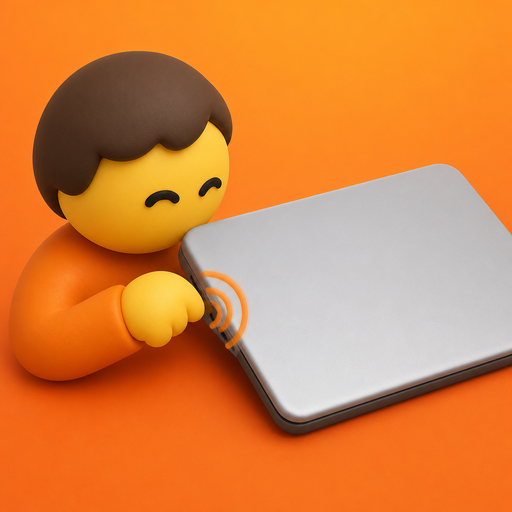
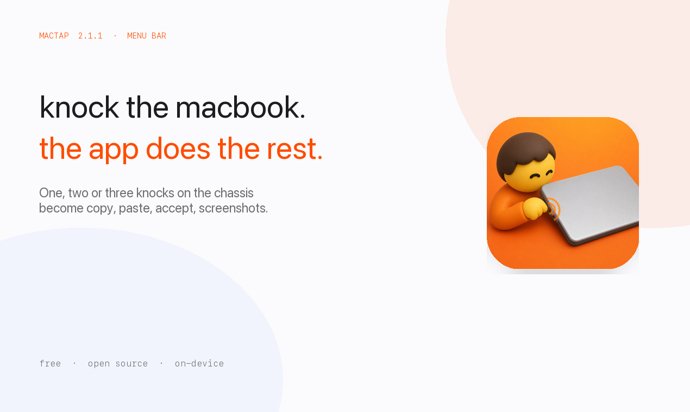
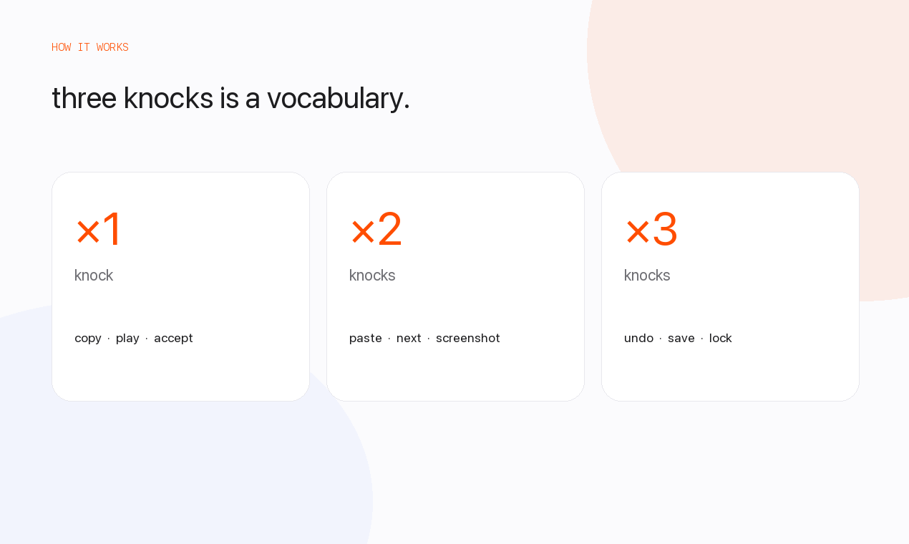
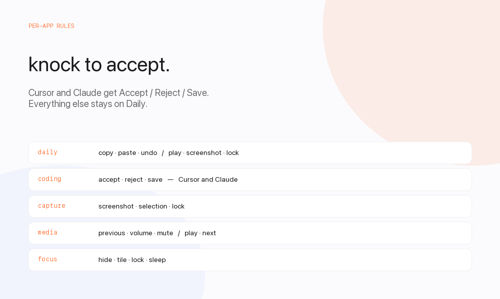

<p align="center">
  
</p>

<h1 align="center">MacTap</h1>

<p align="center">
  <strong>Knock the MacBook. The app does the rest.</strong><br>
  <a href="https://mactap.vercel.app">mactap.vercel.app</a>
  ·
  <a href="https://github.com/jaskirat1616/mactap-app/releases/latest">Download</a>
  ·
  <a href="https://github.com/jaskirat1616/mactap-app">GitHub</a>
</p>

MacTap lives in the menu bar and turns taps on the chassis — or the desk underneath a still laptop — into shortcuts. One, two, or three knocks. Copy, paste, Accept, screenshots, media, or whatever you map.

Requires a MacBook whose motion sensor is exposed as an SPU HID device: **M2 and later**, or **M1 Pro / Max / Ultra**. The original M1 Air (`MacBookAir10,1`) and some other M1 models do not publish the accelerometer HID report MacTap reads, so knocks cannot be detected. macOS 14.6 or later.

MacTap does **not** fall back to rebinding arrow keys when the sensor is missing.

## Install

1. Get **2.1.2** from the [website](https://mactap.vercel.app) or the [latest GitHub release](https://github.com/jaskirat1616/mactap-app/releases/latest).
2. Prefer **MacTap-2.1.2.zip**. Unzip and drag **MacTap.app** into `/Applications`.
3. Or open **MacTap-2.1.2.dmg** and drag **MacTap** into Applications — do not run it from the disk image.
4. Open MacTap from Applications (or Spotlight).
5. Turn on **Accessibility** when asked, so knocks can send shortcuts.

Detection itself does not need Accessibility. Actions do.

### macOS signature check

The **app** is Developer ID signed and notarized. Gatekeeper evaluates `MacTap.app`, not the `.dmg` wrapper. A `codesign --verify` on the disk image itself will say it is unsigned even when the build is good.

After you copy the app into Applications:

```bash
spctl --assess --type execute --verbose /Applications/MacTap.app
```

You want `accepted` and `source=Notarized Developer ID`. If a tool blocks the `.dmg`, install from the **zip** instead.

<table>
  <tr>
    <td align="center" width="33%"></td>
    <td align="center" width="33%"></td>
    <td align="center" width="33%"></td>
  </tr>
</table>

## Use

- **Anywhere** — one, two, or three knocks on the chassis or desk. Same idea as Knock.
- **Left & Right** — each edge is a different set of actions.
- **Presets** — Daily, Coding, Capture, Media, Focus.
- **Per app** — Cursor can get Accept / Reject / Save while everything else stays on Daily.

Open **Settings** from the menu extra to change layout, actions, and sensitivity.

## Build from source

```bash
brew install xcodegen
xcodegen generate
xcodebuild -project MacTap.xcodeproj -scheme MacTap -configuration Debug \
  CONFIGURATION_BUILD_DIR=/Applications
open /Applications/MacTap.app
```

A signed, notarized build:

```bash
./Scripts/ship.sh
```

That writes `dist/MacTap-<version>.dmg`. Notarization uses Xcode’s Developer ID export. Signing the **disk image** (not just the app) also needs App Store Connect API credentials: `APP_STORE_CONNECT_KEY_ID`, `APP_STORE_CONNECT_ISSUER_ID`, and `APP_STORE_CONNECT_API_KEY_P8` (or `AuthKey_*.p8`).

## Privacy

Taps are classified on-device. Nothing is uploaded. Gesture maps live in local defaults.

## License

MIT
